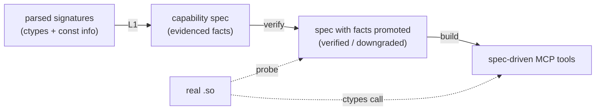

# Ferrule Building the Base 

## 1. The one-sentence summary

so what we're doing now is basically just parsing the type signatures of a c lib into an evidenced capability spec kinda like a decalrative description of each func's semantics with provenance and confidence attachedm nehaviorally verifies the risky facts against the real compiled lib, and genarates the tools from that spec.




---

## 2. The core concept: an *evidenced* spec

The central design idea and the thing that separates our design from a pile of
hand-written overrides  is that **every semantic fact carries its evidence**.
A fact is not "param `q` is an out-param." It is:

```yaml
q:
  role: scalar
  ctype: c_int
  intent:
    value: out
    sources: [const_ness, behavioral_probe]
    confidence: 0.9
    verified: true
```

The value, *where it came from*, *how confident we are*, and *whether a probe
confirmed it*. This lets the consumer (the MCP server) treat a `verified: true`
fact as trustworthy and a low-confidence unverified fact as something to refuse
(fail-safe). The spec carries "the answer plus how much to trust it and why."

**Where this idea comes from.** The provenance/trust structure is adapted from
two places:
- The **provenance-and-trust model in the ORA design** ,
  where each tool-manifest field records whether it was asserted, hinted, or
  assumed, and safety properties treat assumed values conservatively.
- The broader principle in **specification-inference research** (e.g. DAInfer,
  FSE'24; Doc2Spec) that inferred specs must be *validated*, not trusted an
  inferred fact is a candidate until checked.

The vocabulary of the spec itself (`intent = in/out/inout`, `role`, and the
reserved `dimension`/`owner` fields) is taken directly from two established
annotation systems:
- **Microsoft SAL** (`_In_`, `_Out_`, `_Inout_`): the industrial standard for
  annotating C parameter direction.
- **LLNL Shroud** (`intent`, `dimension`, `owner`, `deref`): a mature
  declarative binding-generator whose annotation set covers arrays-with-
  dimension and caller/library ownership. We adopt its vocabulary rather than
  inventing our own.

---

## 3. What each component does

### 3.1 The vocabulary (`spec/vocab.py`)

Two closed enums:
- `Intent`: `in`, `out`, `inout`  parameter direction (from SAL/Shroud).
- `Role`: `scalar`, `string`, `array`, `length_of`, `buffer`, `handle`,
  `callback`, `opaque` — what a parameter *is*. for now we're using only `scalar`, `string`,
  and `opaque`; the rest are reserved for later down the line .

### 3.2 The schema (`spec/schema.py`)

Dataclasses (should probabily use pydeantic):
- `Evidenced`:value + sources + confidence + verified. The wrapper every fact
  uses.
- `ParamSpec`: name, role, `Evidenced` intent, ctype, plus reserved
  `dimension`/`owner`/`handle_type` fields (unused so far).
- `FunctionSpec`, `LibrarySpec`: the containers.
- A small **ctype-name ↔ ctypes-object registry** so specs serialize to strings
  (`c_int`) but rebind to real `ctypes` types at load.

### 3.3 The L1 signature layer (`layers/l1_signature.py`)

Turns the parser's output : `{fname: {argnames, argtypes, restype, pointers}}`
— into an evidenced spec. The rules:

| Input | Fact produced | Evidence | Confidence | Verified? |
| --- | --- | --- | --- | --- |
| plain scalar | `intent: in` | `[type]` | 1.0 | yes (type is certain) |
| `const char*` (`c_char_p`) | `role: string, intent: in` | `[type]` | 1.0 | yes |
| non-const scalar `T*` classified `out` | `intent: out` | `[const_ness]` | 0.9 | **no**  awaits a probe |
| manual override (`inout`/`out`) | that intent | `[manual]` | 1.0 | yes (operator-asserted) |
| unclassified pointer | `role: opaque` | `[]` | 0.0 | no |

**Where this comes from.** The const-ness rule (non-const pointer ⇒ candidate
output, `const` ⇒ input) is the same signal SAL and Shroud encode by hand; L1
reads it automatically from the header. The critical honesty is that a
const-derived `out` is emitted **unverified at 0.9** const-ness is a
convention, not a proof, so the fact is a *candidate* until §3.4 confirms it.

### 3.4 The behavioral verification gate (`verify/probes.py`)

The gate that makes "infer → verify → trust" real. For each inferred
`out`/`inout` param, it calls the **real** function with a distinctive sentinel
value in the out-cell and benign inputs elsewhere; if the cell changes, the
write is confirmed and the fact is promoted to `verified: true` (adding
`behavioral_probe` to its sources). If the cell is *not* written, the fact is
**downgraded** (confidence halved), never silently trusted.

This is the property that makes the output usable on a library you didn't write:
inference can be wrong, but a wrong `out` guess gets caught by the probe rather
than exposed as a confidently-wrong tool.


### 3.5 The spec-driven tool builder (`server/build.py`)

Reads the spec and routes each function by `(role, intent)` to a pattern
handler, returning callable `ToolDescriptor`s:
- scalar `in` / string `in` → pass the value (with str↔bytes marshalling).
- scalar `out` → hidden from the schema; allocate, pass by reference, return.
- scalar `inout` → visible; seed from the caller, pass by reference, return.

Two safety behaviors:
- **NaN/inf → null** marshalling (JSON can't carry non-finite floats).
- A **fail-safe guard** (`_check_safe`) that *refuses* to generate a tool for an
  `opaque` role or a low-confidence-unverified fact, raising `SpecViolation`
  rather than guessing.


### 3.6 Spec I/O, MCP wrapper, CLI

- `spec/io.py`: YAML round-trip (verified stable: dump → load → dump is
  identical).
- `server/mcp_server.py`: the only file coupled to the `mcp` package (lazy
  import); registers the descriptors with FastMCP.
- `cli.py`: `ferrule infer` (header → spec, via the libclang bridge) and
  `ferrule verify` (probe a spec against a lib).

---

## 4. How it maps onto the old hand-wired server

| Hand-wired server (before) | Ferrule Phase 1 (now) |
| --- | --- |
| inline const-classifier in the server | L1 layer, emitting evidenced facts |
| `POINTER_OVERRIDES = {...}` in code | an `overrides` input folded into the spec, marked `verified` |
| classification decided per request | decided once, serialized to a spec YAML |
| trust the classifier | **behaviorally verify** each out-param before trust |
| `_unhandled_pointers` guard | `_check_safe` fail-safe on opaque/low-confidence |

Same behavior, but now the intent knowledge is *data*, *evidenced*, and
*verified* which is what lets later phases add better inference without
touching the server.


---


## 5. Attribution summary

| Concept used | Source |
| --- | --- |
| `intent = in/out/inout` annotation | Microsoft SAL |
| `intent` / `dimension` / `owner` / `deref` vocabulary | LLNL Shroud |
| provenance/trust per fact, conservative defaults | our ORA design; spec-inference literature (DAInfer, FSE'24) |
| infer-then-validate stance | APEX (2016); neurosymbolic spec inference (DAInfer, Doc2Spec) |
| behavioral differential verification | our previous method, generalized |
| pattern-handler-per-idiom structure | PLDI'09 static-analysis binding generator |